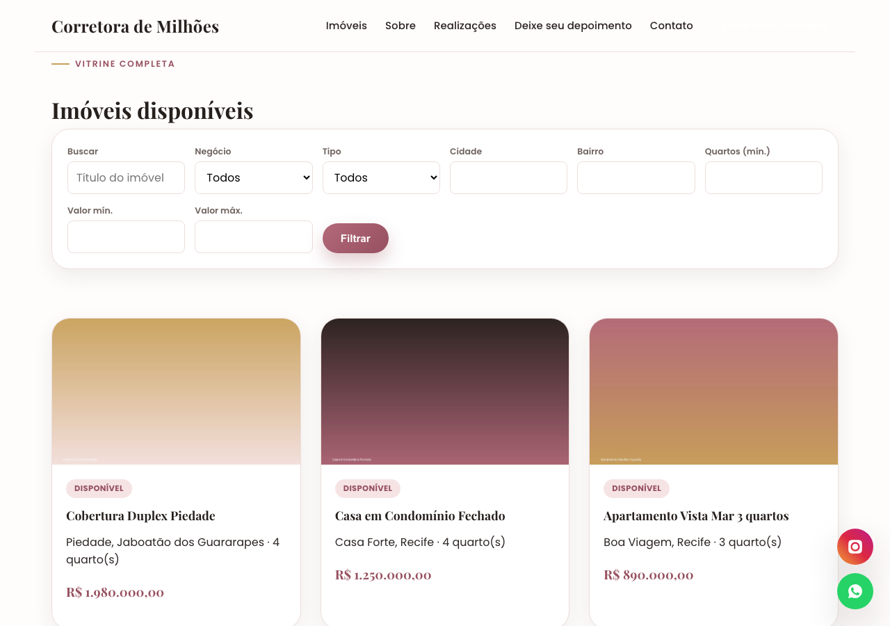
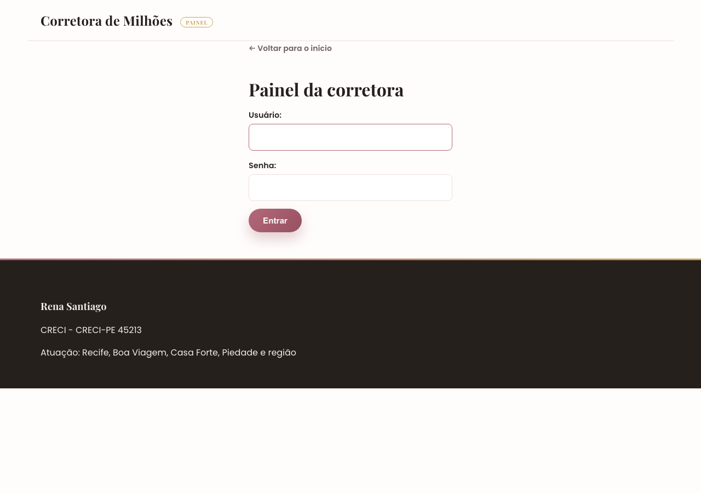

# Corretora de Milhões


Site completo para uma corretora de imóveis independente: vitrine pública com busca e filtros, painel de autoatendimento (a própria corretora cadastra imóveis, atualiza status e publica negócios fechados, sem depender de desenvolvedor), captação de leads integrada ao WhatsApp e moderação de depoimentos.

Projeto pessoal de portfólio, com deploy real em produção. Não é um boilerplate nem um tutorial seguido à risca.

🔗 **[Ver o site no ar](https://corretora-de-milhoes.onrender.com)**

> **Nota sobre o link acima:** o deploy está no plano gratuito do Render. Depois de ~15 minutos sem receber acesso, o serviço "dorme" para economizar recursos. O primeiro carregamento após esse período pode levar de 30 a 50 segundos enquanto a instância acorda. Acessos seguintes voltam a ser instantâneos. Isso é uma característica do plano gratuito de hospedagem, não do código.


## Sobre o projeto

O objetivo era resolver um problema real de um pequeno negócio: uma corretora autônoma que precisava de um site próprio (em vez de depender só de portais de terceiros), com total autonomia para atualizar o catálogo de imóveis sozinha, sem precisar pedir ajuda técnica a cada mudança.

Por isso o projeto é dividido em duas metades com necessidades bem diferentes:

- **Parte pública**, otimizada para o visitante: vitrine rápida, busca por filtros, contato em um clique direto pro WhatsApp.
- **Painel administrativo**, otimizado para quem não é técnica: formulários simples, ações de um clique (marcar como vendido, aprovar depoimento) e zero jargão técnico na interface.

## Funcionalidades

**Público**
- Home com destaques, imóveis em evidência e depoimentos aprovados.
- Vitrine de imóveis com busca por texto e filtros combinados (tipo de negócio, tipo de imóvel, cidade, bairro, nº de quartos, faixa de valor).
- Página de detalhe do imóvel: galeria de fotos, vídeo do YouTube incorporado, mapa (Google Maps embed) e botão de interesse.
- Formulário de contato: salva o lead no banco (histórico da corretora) **e** redireciona o visitante pro WhatsApp com a mensagem já preenchida. Nenhum contato se perde, mesmo se o e-mail de notificação falhar.
- Envio de depoimentos por clientes, com moderação antes de aparecer no site.

**Painel da corretora** (autenticado)
- Dashboard com indicadores (imóveis disponíveis, negócios fechados, leads pendentes, depoimentos aguardando aprovação).
- CRUD completo de imóveis com upload de várias fotos por formulário.
- Troca rápida de status (disponível → reservado → vendido/alugado) sem abrir o formulário inteiro.
- Publicação de "negócio fechado" (prova social) vinculada a um imóvel.
- Moderação de depoimentos (aprovar/excluir) e listagem de leads recebidos.
- Edição do próprio perfil (bio, CRECI, WhatsApp, redes sociais).

## Decisões técnicas que valem destaque

Alguns problemas reais de produção resolvidos ao longo do projeto (não só "features"):

- **Upload de fotos sem estourar memória** — o processamento de imagem foi ajustado para redimensionar no momento do upload em vez de guardar o arquivo original inteiro, evitando que o worker do Gunicorn fosse morto por falta de memória (OOM) no plano gratuito do Render.
- **Formulário de contato blindado contra timeout de e-mail** — o envio de e-mail de notificação roda com timeout e captura de exceção isolados: se o SMTP travar ou falhar, o lead do cliente é salvo normalmente e a página de sucesso carrega do mesmo jeito.
- **Rate limiting sem infraestrutura extra** — limite de tentativas por IP no login do painel e no formulário público de contato, usando só o cache padrão do Django (sem Redis/serviço externo).
- **Armazenamento de mídia persistente** — como o disco do Render é apagado a cada deploy, as fotos dos imóveis vão para o Supabase Storage (S3-compatible) em produção; em desenvolvimento, caem no disco local automaticamente, sem precisar configurar nada.
- **Hardening de produção** — HTTPS forçado, cookies de sessão/CSRF seguros, HSTS, sessão expirando em 8h e ao fechar o navegador, tudo condicionado a `DEBUG=False` para não atrapalhar o desenvolvimento local.

## Stack

| Camada | Tecnologia | Por quê |
|---|---|---|
| Back-end | Python + Django 5 | Admin, autenticação e ORM prontos. Acelera o painel administrativo (a parte mais trabalhosa) sem precisar de API + front separados. |
| Banco de dados | SQLite (dev) → PostgreSQL via Supabase (produção) | Troca automática por `DATABASE_URL`, zero configuração em desenvolvimento. |
| Armazenamento de mídia | Supabase Storage (S3-compatible) via `django-storages` | Disco do Render é efêmero; fotos precisam de armazenamento persistente. |
| Servidor de produção | Gunicorn + WhiteNoise | Serve estáticos comprimidos direto da aplicação, sem depender de Nginx/CDN. |
| Config/segredos | `django-environ` | Variáveis sensíveis fora do código-fonte. |
| Deploy | Render (Blueprint via `render.yaml`) | Deploy automático a cada push na `master`. |
| Testes | `django.test` (unittest) | 21 testes cobrindo os fluxos principais das 5 apps. |
| Front-end | Templates Django + CSS puro | Suficiente para o escopo atual; migrável para Tailwind/HTMX sem tocar no back-end. |

## Testes automatizados

```bash
python manage.py test
```

21 testes cobrindo os fluxos de cada app (cadastro/edição de imóvel, formulário de contato, moderação de depoimentos, autenticação do painel, etc.).

## Screenshots

| Vitrine com filtros | Login do painel |
|---|---|
|  |  |

## Estrutura do projeto (apps Django)

| App | Responsabilidade |
|---|---|
| `imoveis` | Modelo central: `Imovel`, `ImovelFoto`, `Realizacao`. Vitrine pública com busca/filtros e página de detalhe. |
| `perfil` | Dados da corretora (singleton): nome, CRECI, bio, WhatsApp, redes sociais, localização do escritório. |
| `depoimentos` | Feedback de clientes, pendente de aprovação no painel. Evita spam/reviews falsos. |
| `leads` | Toda submissão do formulário de contato vira um registro aqui (mini-CRM) antes de redirecionar pro WhatsApp. |
| `painel` | Área autenticada: dashboard, CRUD de imóveis, troca de status, publicação de negócios fechados, moderação de depoimentos, leads. |
| `core` | Home pública e o `context_processor` que injeta os dados da corretora em todo template (navbar, rodapé, botão de WhatsApp flutuante). |

## Modelo de dados (visão geral)

```
PerfilCorretora (singleton)
  nome, foto, creci, bio, regiao_atuacao,
  whatsapp, email, instagram_url, facebook_url,
  endereco_escritorio, latitude, longitude

Imovel
  titulo, slug, codigo_referencia, descricao,
  tipo_negocio [venda|aluguel|venda_aluguel],
  tipo_imovel [apartamento|casa|casa_condominio|terreno|comercial|rural|cobertura|outro],
  status [disponivel|reservado|vendido|alugado|inativo],
  valor, valor_condominio, valor_iptu,
  area_construida, area_terreno, quartos, suites, banheiros, vagas_garagem,
  cidade, bairro, endereco, cep, latitude, longitude,
  destaque, video_url, criado_em, atualizado_em

ImovelFoto  (N:1 com Imovel)
  imovel_id, imagem, legenda, ordem

Realizacao  (N:1 opcional com Imovel, "negócio fechado")
  imovel_id (nullable), titulo, texto, foto, publicado_em, visivel

Depoimento  (N:1 opcional com Imovel)
  nome_cliente, email_cliente, texto, nota (1-5),
  imovel_relacionado_id, aprovado, criado_em

Lead  (N:1 opcional com Imovel)
  nome, telefone, email, mensagem,
  imovel_relacionado_id, atendido, criado_em
```

Relacionamentos com `Imovel` usam `on_delete=SET_NULL` (exceto as fotos, que são `CASCADE`). Excluir um imóvel não apaga o histórico de leads/depoimentos/realizações ligados a ele.

## Rodando localmente

```bash
python -m venv venv
source venv/bin/activate       # Windows: venv\Scripts\activate
pip install -r requirements.txt

cp .env.example .env           # ajuste SECRET_KEY se quiser

python manage.py migrate
python manage.py createsuperuser
python manage.py runserver
```

- Site público: http://127.0.0.1:8000/
- Painel da corretora: http://127.0.0.1:8000/painel/login/
- Admin do Django: http://127.0.0.1:8000/admin/

Antes de qualquer coisa aparecer na vitrine, cadastre o `PerfilCorretora` (pelo `/admin/`) e alguns imóveis pelo painel.

## Deploy

Configurado como [Blueprint do Render](render.yaml). No dashboard, "New > Blueprint" apontando para este repositório recria o serviço inteiro (build, variáveis de ambiente, banco). Push na `master` dispara deploy automático. Detalhes de cada variável de ambiente em [`.env.example`](.env.example).

## Roadmap

- [ ] Notificação automática (WhatsApp Business API) quando um lead novo chega.
- [ ] Área de "imóveis favoritos" para visitantes, sem precisar de conta (via sessão).
- [ ] Timeline pública de conquistas no perfil (nº de negócios fechados, tempo de atuação).
- [ ] Comparador de imóveis lado a lado.
- [ ] Reordenação de fotos por drag-and-drop no painel.

## Autor

**Heverton Monteiro** — [github.com/HevertonMonteiro](https://github.com/HevertonMonteiro)

## Licença

MIT — veja [LICENSE](LICENSE).
